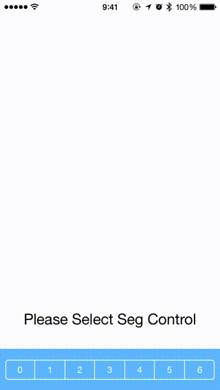

# UIContainerViewControllerTransitionExample

an Example of UIContainerViewController Transition. 

## License

UIContainerViewControllerTransitionExample is available under the MIT license. See the LICENSE file for more info.
